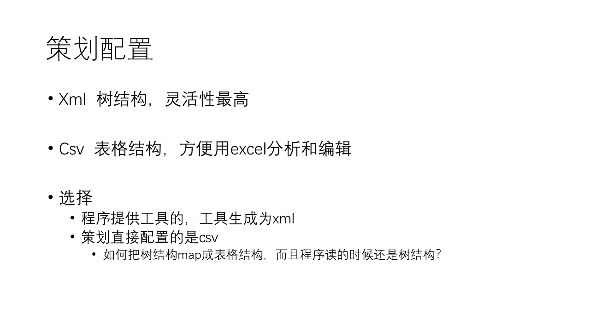
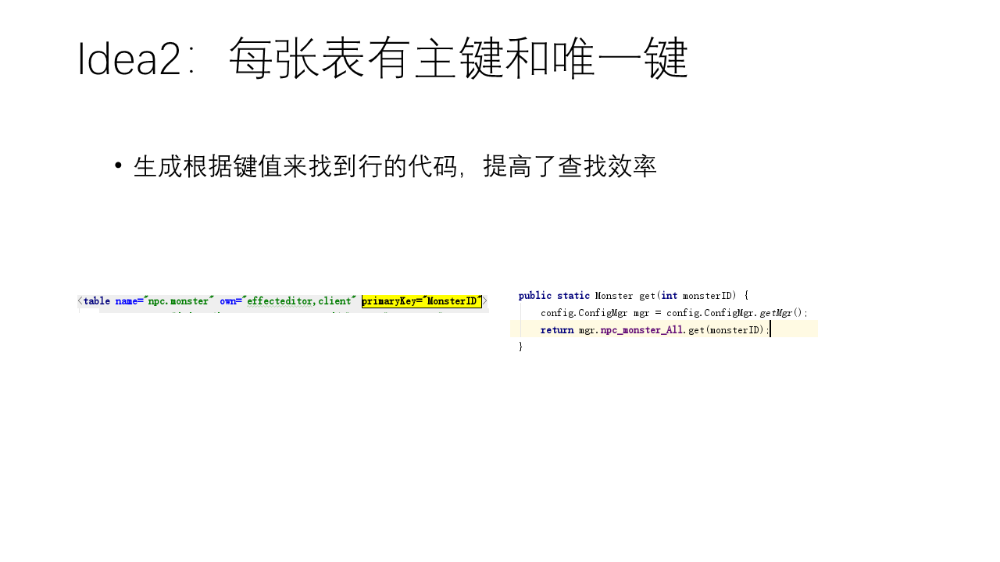
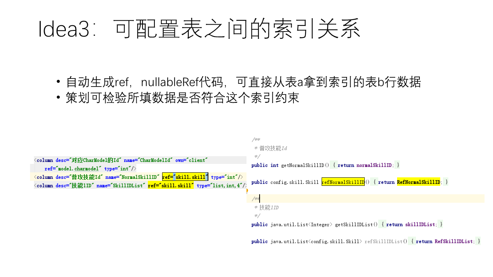
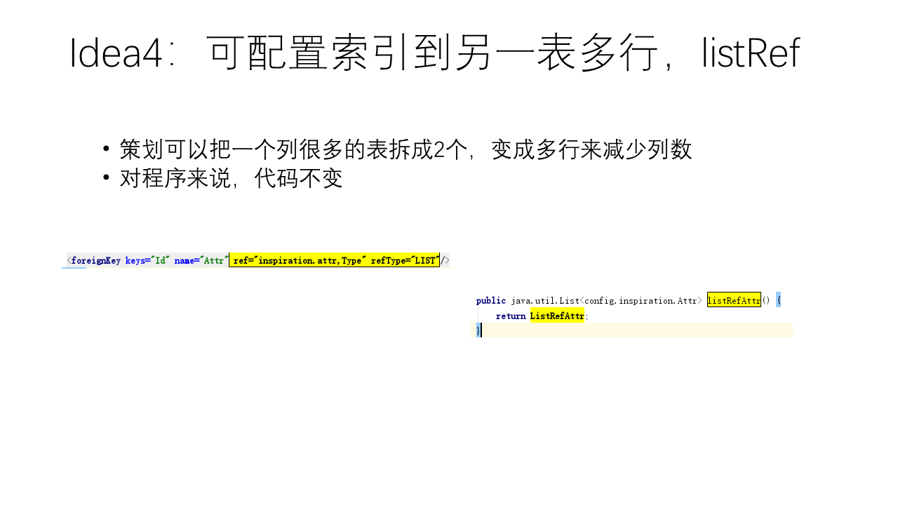
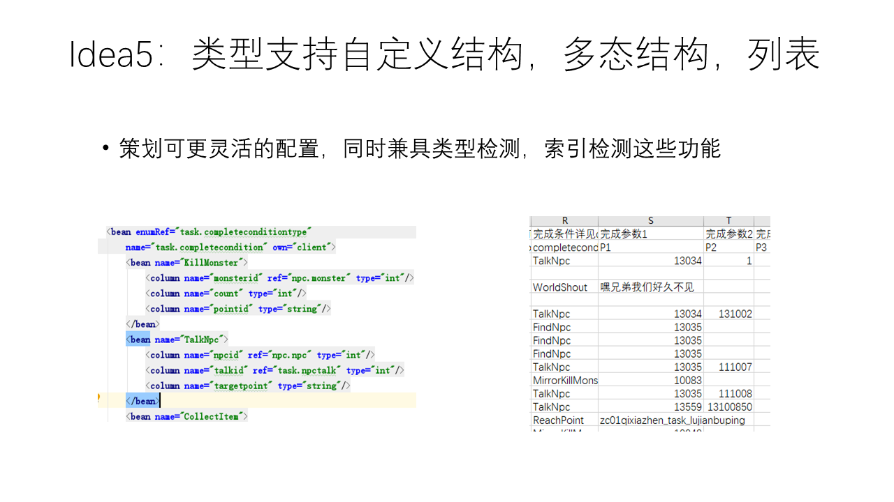
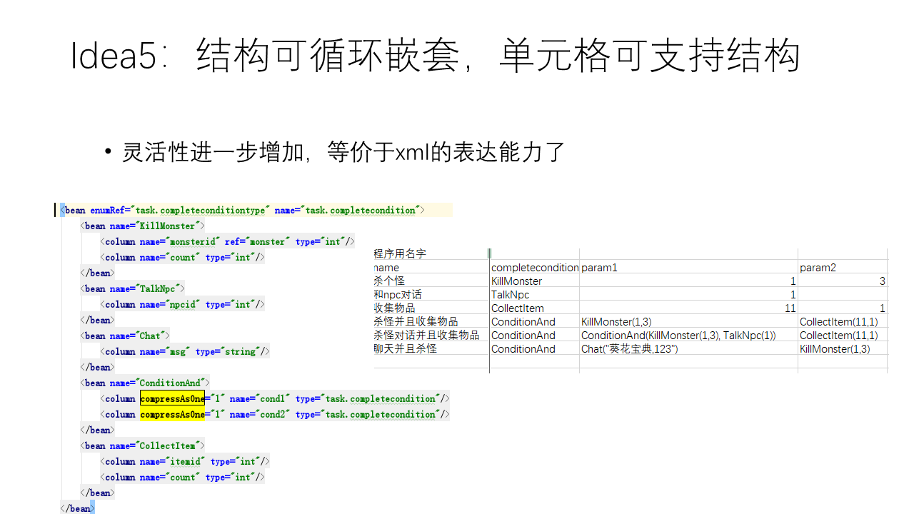
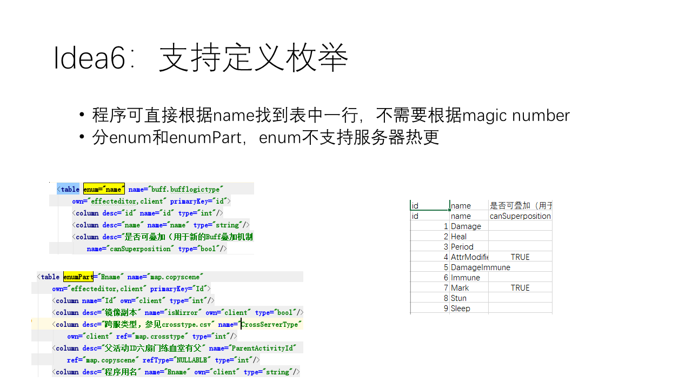
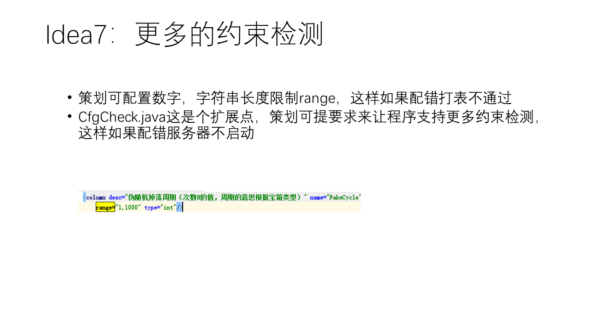

# configgen

让策划可以在excel中做灵活的配置，之后再为程序生成访问配置表的代码

## 主要功能

* 通过配置外键，取值范围，使策划可以随时检测数据一致性

* 通过生成代码，使程序方便访问类型化数据，外键引用和枚举得到一行，支持java,c#,lua

* 支持多态结构，嵌套结构，可在一个单元格里写任意复杂的结构数据，相当于让csv有了xml的灵活性

* 生成java注重安全

* 生成lua注重内存大小

* [ppt - 策划配置系统](doc/策划配置系统.pptx)

* [如何配置 - Configuration](doc/Configuration.md)

* [常见问题 - FAQ](doc/FAQ.md)

## 设计逻辑

