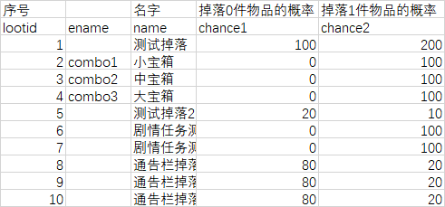
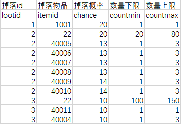
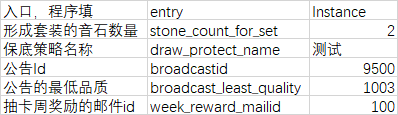
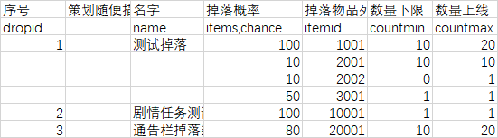

# 给策划看的功能介绍

[TOC]


## 新建或改结构

1. 新建或修改csv或excel文件，csv文件前3行做为header，

   1. 第一行是中文描述，第二行是程序用名
   2. 第三行随意，我们可以约定填类型，但真正的类型以xml里为准
   
2. 然后交给程序就ok了

	* 程序使用configgen.jar 来完善xml，如果xml不满足需求，则手动修改xml，比如修改type，主键，增加唯一键，外键，枚举，取值约束等
	
	  

## 改数据

1. 更改csv或excel里的数据，随便改

2. 然后根据需求双击配表顶层目录下的以下任一文件
   1. 校验数据.bat
   2. 校验数据并生成客户端配置.bat
   3. 校验数据并生成服务器配置.bat
   4. 校验数据并生成客户端和服务器配置.bat
   
3. 如果出错，根据出错提示修改数据，如果正确，则可以提交svn了

   - 我们支持表之间的链接关系（可以让程序来在xml中配置），在校验数据.bat会自动检验这些，比如完成任务里的KillMonster的第一个参数是monsterid，这个id必须在monster表中存在。这个会校验。

   

## 目录结构

- 不要在顶层目录放csv或excel文件，而是都要放到子文件夹下，比如equip目录下


- excel文件可以包含多个sheet，生成时excel文件名被忽略，而直接用sheet名称，csv文件则直接用csv的文件名。
- 每个子文件夹会生成相应的xml，equip目录下生成equip.xml，做为excel，csv数据文件的格式描述，在这里程序会配置上bean，table列的类型，主键，唯一键，外键，枚举，取值约束等

 

## 忽略机制

- 忽略文件

  csv文件或excel里的sheet名称如果不是a-z，A-Z开头的就忽略，策划可以多建sheet或csv来做说明

- 忽略列或行

  - 如果第二行，也就是程序用名中的格子为空，则表明这列程序不用，策划随便写。
  - 如果数据行有一行全为空，则会被程序忽略，用于策划想视觉上分割下这个文件

| 序号     | 策划用列 | 名字    | 掉落0件物品的概率 | 掉落1件物品的概率 | 掉落2件物品的概率 | 掉落3件物品的概率 |
|--------|------|-------|-----------|-----------|-----------|-----------|
| lootid |      | name  | chance1   | chance2   | chance3   | chance4   |
| 1      |      | 测试掉落  | 100       | 200       | 200       | 200       |
| 2      | XXX用 | 小宝箱   | 0         | 100       | 0         | 0         |
|        |      |       |           |           |           |           |
| 4      |      | 大宝箱   | 0         | 100       | 0         | 0         |
| 5      |      | 测试掉落2 | 20        | 10        | 10        | 20        |

  上例中，第二列和第五行会被忽略

  

## 减少拆表

支持自定义结构，嵌套结构，以及多态结构，这些结构的定义由程序来在xml中描述

原来如果要模块化概念，可能要把它放到单独的一个配表中，其他表要引用这个就通过一个id，这样配置一个功能，可能牵涉到非常多的表格文件，现在则可以定义这个概念为结构，在这个功能表格中直接配置这个结构。

这个结构可以占多个单元格；也可以配置为pack只在一个单元格；如果是list或map还可以配置为block占多行。


## 拆表

### 表行数太多怎么办？

比如item表，太多行，那可以分开item.csv，item_1.csv，item_2.csv......如果是excel可以是分成多个sheet，item，item_1，item_2......

逻辑上认为就还是一个item表

### 表列数太多怎么办？

这种一般是表里面有个列表，可能有20个复合结构，复合结构需要5列，那就需要20*5=100列
有两个做法：
1. 对类型为list和map的列用block=“1”模式，这样20个item将占用20行，占用5列，减少了列数，见使用举例里掉落表例子。
2. 分成2个表，把这20个复合结构，配置到另一个细节表中，配20行，加一列数据表示是原表中主键，这样关系就建立起来了。
配置用refType="LIST"，这样从程序从原表中可以直接拿到细节表中多行了。
也可以如下配置掉落表

```xml
<table name="loot" primaryKey="lootid">
    <column desc="序号" name="lootid" ref="lootitem,lootid" refType="LIST" type="int"/>
    ...
</table>
```
```xml
<table name="lootitem" primaryKey="lootid,itemid">
    <column desc="掉落id" name="lootid" ref="loot" type="int"/>
    <column desc="掉落物品" name="itemid" type="int"/>
    ...
</table>
```
掉落主表



掉落细节表



3. 如果细节表的一行 需要被多个主表行共用，可以在主表中配置一个到细节表id的列表，配置上ref，这样程序就可以直接拿到细节表中多行
如可以如下配置
```xml
<table name="loot"> ...
    <column name="lootItemList" ref="lootitem" type="list,int" pack="1"/>
</table>
```


## 单元格

### 可空的单元格

比如dialog表，可以配置一个npcid，如果配置了npcid，则朝向他，如果没配的话就不转向

则如果不配置npc，就把npcid对应的单元格留空，不要填0，-1

- excel或csv单元格中不填的话默认为false,0,""，所以不要用0作为一行的id。如果有nullableRef请不要填0，请用留空。否则程序会检测报错.
        

### 复杂结构的单元格

比如代币奖励，有两个字段，一个是代币类型，一个是数量，可以在一个单元格里配置，比如
```xml
<bean name="Reward">
    <column name="coin" ref="cointype" type="int"/>
    <column name="count" type="int"/>
</bean>
```
```xml
<table name="xxx" > ...
    <column name="reward" type="Reward" pack="1"/>
</table>
```

| reward |
| ------ |
| 1,100  |

甚至可以在一个单元格里配置代币奖励列表
```xml
<table name="xxx"> ...
    <column name="rewardList" type="list,Reward" pack="1"/>
</table>
```

| rewardList     |
| :------------- |
| (1,100),(2,50) |

还支持多态的类型，比如task表，需要配置任务完成条件，可以如下

```xml
<bean enumRef="completeconditiontype" name="completecondition">
    <bean name="KillMonster">
        <column name="monsterid" ref="npc.monster" type="int"/>
        <column name="count" type="int"/>
    </bean>
    <bean name="LevelUp">
        <column name="level" type="int"/>
    </bean>
    <bean name="ConditionAnd">
        <column name="cond1" pack="1" type="task.completecondition"/>
        <column name="cond2" pack="1" type="task.completecondition"/>
    </bean>
    <bean name="GatherItem">
        <column name="itemid" ref="item.item" type="int"/>
        <column name="count" type="int"/>
    </bean>
</bean>
```
```xml
<table name="task"> ...
    <column name="Condition" type="task.completecondition"/>
</table>
```

| Condition                               |
| :-------------------------------------- |
| GatherItem(1001, 1)                     |
| CondAnd(LevelUp(5),KillMonster(101, 3)) |

## 使用举例

### 物品表

比如物品表item，物品包含装备，宝石，货币等分类，每个分类下可能有独特的属性，怎么配置舒服呢？

- 可以有个默认的item表，有type字段指向另一个itemtype表，itemtype表里配置上装备，宝石，货币等分类，item表用于配置所有分类共有的属性，比如名称，允许堆叠上限等，
- 而装备equip，跟宝石gem可能有各自独特的属性，那再加上itemequip表，itemgem表，这两个表内的id跟item表相同，配置它索引到item表，然后其他列加上equip，gem特有的属性就行。

另一种做法是：

- 只配置一个item表，item表定义前面是共有字段，后面有个extra字段是多态类型，可以是装备，宝石，货币，各包含自己独有的属性，然后再利用我们已有分拆文件功能，可以装备都放入item_1，宝石都放入item_2

我个人还是推荐第一种做法：

第一种做法不好得地方在于：一个装备id，要配置在两处，一个item表，一个itemequip表。有重复。

但好处是另外的表可以声明（ref）自己字段是个itemequip，如果第二种只能声明字段是item。第二种程序也会要多做一些判断，我期望的是itemequip，但我拿到的类型是item，那item.extra是不是equip我需要判断啊，不是怎么处理。不好写。


### 模块全局配置

比如一个模块有全局的属性，那怎么配置舒服呢？

- 可以配置一行，用entry来引用这整行。

- 但这样可能列数太多，看着不舒服，我们还有列模式机制，在这个表上配置上isColumnMode="true"，那可以把表反转90度，很多列，变成很多行，配置起来舒服多了

```xml
<table name="xxx" isColumnMode="1"> ...
</table>
```




### 掉落表

掉落表里，单个掉落dropid，要对应有物品掉落个数和概率的一个列表

```xml
<bean name="DropItem">
    <column desc="掉落概率" name="chance" type="int"/>
    <column desc="掉落物品" name="itemid" type="int"/>
    <column desc="数量下限" name="countmin" type="int"/>
    <column desc="数量上限" name="countmax" type="int"/>
</bean>
```
```xml
<table name="xxx"> ...
    <column block="1" desc="掉落概率" name="dropItems" type="list,DropItem"/>
</table>
```

这里把dropItems配置为block模式，允许用一块而不止一行来配置list


